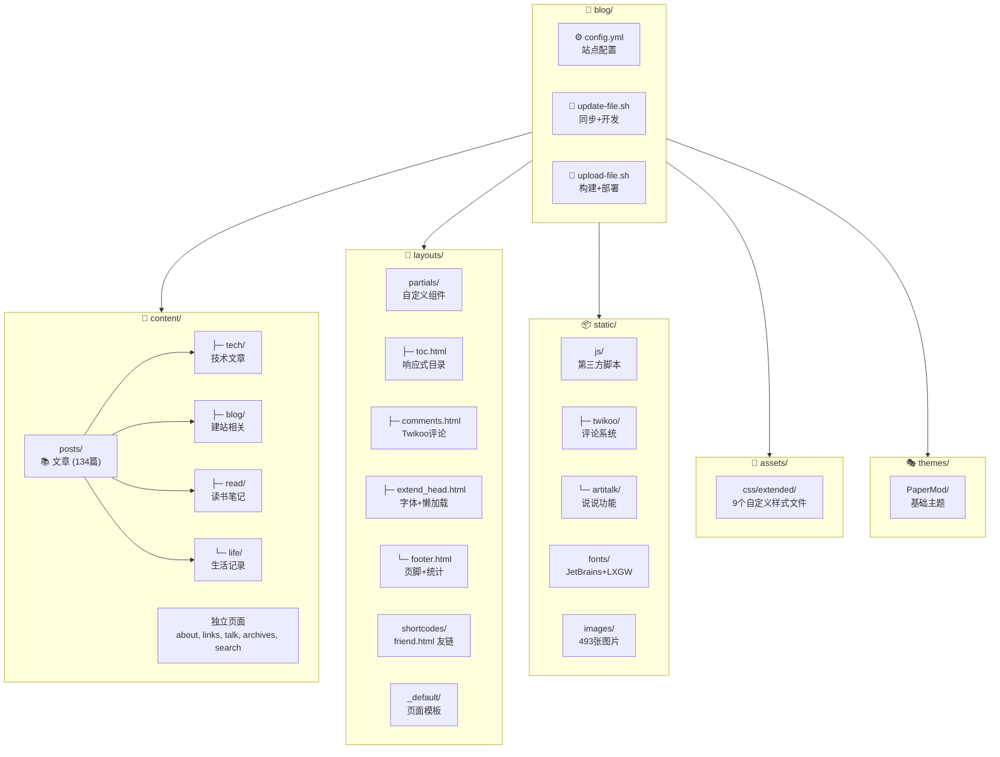

# CLAUDE.md

> 📅 最后更新: 2026-01-08 | 📊 项目文件数: ~2728 | 📝 文章数: 134

This file provides guidance to Claude Code (claude.ai/code) when working with code in this repository.

## Project Overview

Hugo 静态博客, 基于 PaperMod 主题 (源自 sulv 修改版). 内容使用中文, 通过 Obsidian 编写后同步至 Hugo.

- 站点地址: https://www.lvbibir.cn
- 主题仓库: https://github.com/adityatelange/hugo-PaperMod
- 模板仓库: https://github.com/xyming108/sulv-hugo-papermod

## Requirements

- **Hugo**: v0.100.0+ (extended 版本非必需)
- **Git**: 用于 submodule 管理

## Git Submodule

PaperMod 主题通过 git submodule 管理，当前锁定版本: **v6.0** (commit: d3d90be)

**版本定义机制:**
- `.gitmodules`: 定义 submodule 路径和远程 URL
- Git 索引: 主仓库 tree 中记录 submodule 指向的具体 commit (`git ls-tree HEAD themes/`)

```bash
# 首次克隆项目后初始化 submodule
git submodule update --init --recursive

# 更新主题到最新版本 (谨慎操作，可能引入破坏性变更)
git submodule update --remote themes/PaperMod
git add themes/PaperMod && git commit -m "chore: update PaperMod theme"

# 回退到指定版本
cd themes/PaperMod && git checkout d3d90be && cd ../..
git add themes/PaperMod && git commit -m "chore: revert PaperMod to d3d90be"

# 查看当前 submodule 状态
git submodule status
```

## Project Structure (Mermaid)



## Commands

### 开发

```bash
# 从 Obsidian 同步内容并启动开发服务器 (包含草稿)
./update-file.sh

# 仅启动开发服务器
hugo server -D
```

### 构建与部署

```bash
# 构建并部署到远程服务器
./upload-file.sh

# 仅构建静态文件
hugo -F --cleanDestinationDir
```

## Content Workflow

内容源自 Windows OneDrive 中的 Obsidian vault:
- 文章: `/mnt/c/Users/lvbibir/OneDrive/1-lvbibir/obsidian/lvbibir/blog/` -> `content/posts/`
- 图片: `/mnt/c/Users/lvbibir/OneDrive/1-lvbibir/obsidian/lvbibir/images/` -> `static/images/`

文章分类目录:
- `content/posts/tech/` - 技术文章 (118 篇)
- `content/posts/blog/` - 建站相关 (8 篇)
- `content/posts/read/` - 读书笔记 (4 篇)
- `content/posts/life/` - 生活记录 (3 篇)

## Architecture

### 自定义布局 (覆盖 PaperMod 主题)

| 文件 | 用途 | 关键特性 |
|------|------|----------|
| `layouts/partials/toc.html` | 自定义目录 | 宽屏侧边栏 + 移动端弹出 + 滚动高亮 |
| `layouts/partials/comments.html` | Twikoo 评论系统 | self-hosted, 版本可配置 |
| `layouts/partials/extend_head.html` | 自定义字体 + 图片懒加载 | IntersectionObserver API |
| `layouts/partials/footer.html` | 页脚 | 运行时间 + 不蒜子统计 + 阅读进度 |
| `layouts/shortcodes/friend.html` | 友链卡片 | 命名参数: name, url, logo, word |
| `layouts/_default/_markup/render-image.html` | 图片懒加载渲染 | data-src 延迟加载 + noscript 回退 |
| `layouts/_default/_markup/render-link.html` | 链接渲染钩子 | 外部链接自动 `target="_blank"` + 绿色样式 |
| `layouts/partials/cover1.html` | 封面图组件 | 响应式图片 srcset + 居中布局 |
| `layouts/_default/baseof.html` | 基础模板 | 扩展 body class 支持 tags/about/links/talk 页面 |

#### 组件实现详解

**toc.html (目录组件)** - 289 行
```
核心功能:
├── 宽屏模式: position: absolute + sticky, 固定在文章左侧
├── 移动端模式: 浮动按钮触发侧边抽屉 (transform: translateX)
├── 滚动高亮: IntersectionObserver 监听 h1-h6, 动态添加 .active 类
├── 交互支持: ESC 键关闭、遮罩层点击关闭、链接点击后自动关闭
└── 响应式切换: checkTocPosition() 根据视口宽度切换模式
```

**footer.html (页脚组件)**
```javascript
// 运行时间计算 (起始: 2021-07-13)
var X = new Date("7/13/2021 1:00:00");
var T = (Y.getTime() - X.getTime());
// 输出: "网站已运行 X 天 X 小时 X 分 X 秒"

// 阅读进度计算
readProgress.innerText = ((scrollTop / (scrollHeight - clientHeight)) * 100).toFixed(0);
```

**extend_head.html (懒加载实现)**
```javascript
// IntersectionObserver 配置
{
  rootMargin: '50px 0px',  // 提前 50px 开始加载
  threshold: 0.01          // 1% 可见即触发
}
// 回退: 不支持 IO 的浏览器直接加载所有图片
```

**render-image.html (图片渲染钩子)**
```html
<!-- 懒加载: 1x1 透明 GIF 占位 + data-src 存储真实地址 -->

<!-- noscript 回退: JS 禁用时显示原图 -->
<noscript></noscript>
```

### 第三方集成

| 功能 | 实现 | 位置 |
|------|------|------|
| 评论系统 | Twikoo (self-hosted) | `static/js/twikoo/` |
| 说说页面 | Artitalk (LeanCloud 后端) | `static/js/artitalk/` |
| 字体 | JetBrains Mono + LXGW 混合字体 | `static/fonts/JetBrainsLxgwNerdMono/` |
| 访问统计 | 不蒜子 | 外部脚本 |

### 自定义样式 (assets/css/extended/)

| 文件 | 用途 | 行数 |
|------|------|------|
| `blank.css` | 主样式文件 (标题/暗色模式/图片/表格) | 338 |
| `toc.css` | 目录样式 (响应式/高亮/动画) | 249 |
| `code.css` | 代码块样式 (Mac 风格装饰) | 100 |
| `friend-link.css` | 友链卡片样式 (悬停旋转动画) | 103 |
| `transition.css` | 过渡动画效果 | 90 |
| `pagination.css` | 分页组件样式 | 68 |
| `reward.css` | 打赏组件样式 | 45 |
| `comment.css` | 评论区样式 | 30 |
| `tag-cloud.css` | 标签云样式 | 23 |

#### CSS 变量体系 (blank.css)

```css
:root {
    /* 布局尺寸 */
    --article-width: 650px;    /* 文章内容宽度 */
    --toc-width: 230px;        /* 目录宽度 */
    --footer-height: 90px;     /* 页脚高度 */

    /* 颜色系统 */
    --hljs-bg: rgb(44, 44, 44);           /* 代码块背景 */
    --code-bg: rgb(240, 240, 240);        /* 行内代码背景 */
    --code-bg-border: rgb(200, 200, 200); /* 代码边框 */

    /* 动画系统 */
    --transition-duration: 0.4s;
    --box-shadow-default: 0px 2px 4px rgb(5 10 15 / 40%), 0px 7px 13px -3px rgb(5 10 15 / 30%);
    --box-shadow-hover: 0px 4px 8px rgb(5 10 15 / 40%), 0px 7px 13px -3px rgb(5 10 15 / 30%);
    --box-shadow-light: 1px 2px 2px 1px rgb(144 164 174 / 60%);
}
```

#### 样式实现详解

**blank.css 主要功能:**
- 标题样式: h1-h3 带 `border-bottom: 1px solid #ddd`
- 暗色模式: `.dark` 类下文字颜色 `rgba(180, 181, 182, 0.8)`
- 图片效果: `border-radius: 10px` + `img:active { transform: scale(1.35) }`
- 引言块: `border-left: 4px solid #42b983` + 绿色半透明背景
- 表格: GitHub 风格，隔行变色 `nth-child(2n)`
- 列表缩进: ul 30px, ol 40px, 二级列表递减

**toc.css 响应式设计:**
```css
/* 宽屏: 绝对定位在文章左侧 */
.toc-container.wide {
    position: absolute;
    left: calc((var(--toc-width) + var(--gap)) * -0.85);
}

/* 移动端: 侧边抽屉 */
.toc-container.mobile-popup {
    position: fixed;
    transform: translateX(-100%);  /* 默认隐藏 */
}
.toc-container.mobile-popup.active {
    transform: translateX(0);      /* 显示 */
}

/* 高亮样式 */
.active {
    color: #42b983;
    border-bottom-color: #42b983;
}
```

**code.css Mac 风格装饰:**
```css
/* 三个彩色圆点 */
.bb1 { background: #ef4943; }  /* 红 */
.bb2 { background: #f5b228; }  /* 黄 */
.bb3 { background: #20d032; }  /* 绿 */

/* 代码块圆角 */
.mac-tool {
    border-top-left-radius: var(--radius);
    border-top-right-radius: var(--radius);
}
```

**friend-link.css 友链卡片:**
```css
/* 悬停效果: 放大 + 头像旋转 */
.frienddiv:hover {
    transform: scale(1.08);
}
.frienddiv:hover .frienddivleft img {
    transform: rotate(360deg);
    transition: 0.9s;
}

/* 响应式: 小屏隐藏描述 */
@media screen and (max-width: 600px) {
    .friendinfo { display: none; }
}
```

**transition.css 通用动画类:**
```css
.hover-scale-sm:hover { transform: scale(1.02); }  /* 文章卡片 */
.hover-scale-md:hover { transform: scale(1.06); }  /* Logo */
.hover-shadow:hover { box-shadow: var(--box-shadow-hover); }
```

### 配置要点 (config.yml)

| 配置项 | 值 | 说明 |
|--------|-----|------|
| `hasCJKLanguage` | `true` | 中文字数统计 |
| `markup.goldmark.renderer.unsafe` | `true` | 允许 Markdown 中嵌入 HTML |
| `permalinks.post` | `"/:title/"` | 文章 URL 格式 |
| `params.ShowToc` | `true` | 显示目录 |
| `params.TocOpen` | `true` | 默认展开目录 |
| `params.twikoo.version` | `1.6.44` | Twikoo 版本 |

## Front Matter

文章常用 front matter:

```yaml
---
title: "文章标题"
date: 2024-01-01
lastmod: 2024-01-02  # 可选, 显示更新时间
tags: [tag1, tag2]
description: "文章摘要"
cover:
    image: "/images/xxx.png"  # 可选, 封面图
draft: false
---
```

## Shortcodes

友链使用:
```

```

## Module Index

| 模块 | 路径 | 文件数 | 说明 |
|------|------|--------|------|
| 布局 | `layouts/` | 17 | 自定义 HTML 模板 |
| 静态资源 | `static/` | ~2549 | JS/字体/图片 |
| 内容 | `content/` | 134+ | Markdown 文章 |
| 样式 | `assets/css/` | 9 | 自定义 CSS (blank, toc, code, friend-link 等) |
| 主题 | `themes/PaperMod/` | - | 基础主题 (git submodule) |

## Development Notes

### 图片懒加载实现

使用 IntersectionObserver API，在 `extend_head.html` 中实现:
- 图片初始使用 `data-src` 存储真实地址
- 进入视口 50px 范围时加载
- 兼容不支持 IO 的浏览器

### TOC 响应式设计

`toc.html` 实现了双模式目录:
- **宽屏模式**: 固定在文章左侧，可切换显示/隐藏
- **移动端模式**: 浮动按钮触发弹出层，支持 ESC 关闭

### 部署流程

```
Obsidian (Windows)
    ↓ rsync
content/posts/ + static/images/
    ↓ hugo build
public/
    ↓ rsync
远程服务器 (root@lvbibir.cn:/root/blog/data/hugo/)
```

### 脚本实现详解

**update-file.sh (开发同步)**
```bash
#!/bin/bash
set -e
# 从 Obsidian 同步文章 (保留权限: 目录 755, 文件 644)
rsync -az --info=progress2 --delete \
    --chmod=Du=rwx,Dg=rx,Do=rx,Fu=rw,Fg=r,Fo=r \
    /mnt/c/.../blog/ content/posts/
# 同步图片
rsync -az --info=progress2 --delete \
    --chmod=Du=rwx,Dg=rx,Do=rx,Fu=rw,Fg=r,Fo=r \
    /mnt/c/.../images/ static/images/
# 启动开发服务器 (含草稿)
hugo server -D
```

**upload-file.sh (生产部署)**
```bash
#!/bin/bash
set -e
# 构建静态文件 (--cleanDestinationDir 清理旧文件)
hugo -F --cleanDestinationDir
# 部署到远程服务器
rsync -az --info=progress2 --delete \
    public/ root@lvbibir.cn:/root/blog/data/hugo/
```

### CI/CD 配置 (.github/workflows/gh-pages.yml)

```yaml
name: github pages
on:
  push:
    branches: [master]

jobs:
  deploy:
    runs-on: ubuntu-24.04
    steps:
      - uses: actions/checkout@v4
        with:
          submodules: true    # 拉取 PaperMod 主题
          fetch-depth: 0      # 完整历史 (用于 .GitInfo)

      - name: Setup Hugo
        uses: peaceiris/actions-hugo@v3
        with:
          hugo-version: '0.100.0'

      - name: Build
        run: hugo --minify

      - name: Deploy
        uses: peaceiris/actions-gh-pages@v3
        with:
          github_token: ${{ secrets.GITHUB_TOKEN }}
          publish_dir: ./public
```

### 主题覆盖机制

Hugo 的模板查找顺序 (layouts 优先于 themes):
```
layouts/partials/toc.html          ← 优先使用 (自定义)
themes/PaperMod/layouts/partials/toc.html  ← 回退 (原版)
```

已覆盖的主题文件:
- `partials/toc.html` - 完全重写，添加响应式和滚动高亮
- `partials/footer.html` - 添加运行时间、统计、阅读进度
- `partials/extend_head.html` - 添加字体和懒加载脚本
- `partials/comments.html` - Twikoo 评论集成
- `_default/_markup/render-image.html` - 懒加载图片渲染
- `_default/_markup/render-link.html` - 外部链接样式
- `_default/baseof.html` - 扩展 body class 判断逻辑
- `partials/cover1.html` - 封面图居中布局
