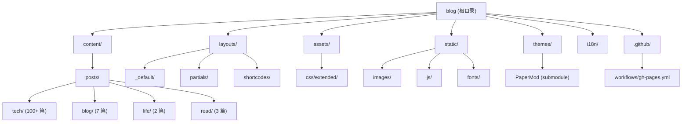

# CLAUDE.md - lvbibir's Blog

> Hugo 静态博客项目 AI 上下文指南

## 变更记录 (Changelog)

| 日期 | 变更 |
|------|------|
| 2026-02-02 | 完整扫描更新: 新增 Series 侧边栏特性, 更新模块文档, 覆盖率提升至 65% |
| 2026-01-10 | 初始化 CLAUDE.md 项目文档 |

---

## 项目愿景

个人技术博客, 主要记录读书笔记, 技术积累, 生活感悟. 使用 Hugo 静态站点生成器, 基于 PaperMod 主题深度定制.

| 属性 | 值 |
|------|-----|
| 域名 | https://www.lvbibir.cn |
| 作者 | lvbibir |
| 框架 | Hugo v0.100.0 (PaperMod 主题) |
| 语言 | 中文 (zh-cn) |
| 起始时间 | 2021-07-13 (WordPress), 2022-07-04 迁移至 Hugo |
| ICP 备案 | 京ICP备2021023168号-1 |

---

## 架构总览



### 目录结构说明

| 目录 | 职责 |
|------|------|
| `content/` | Markdown 内容文件, 按分类组织 (tech/blog/life/read) |
| `layouts/` | Hugo 模板覆盖, 自定义布局和组件 |
| `assets/css/extended/` | 自定义 CSS 样式, PaperMod 扩展点 |
| `static/` | 静态资源 (图片, JS, 字体) |
| `themes/PaperMod/` | 主题子模块 (不直接修改) |
| `i18n/` | 国际化翻译文件 (中文化) |
| `.github/workflows/` | GitHub Actions 自动部署 |

---

## 模块索引

| 模块 | 路径 | 职责 | 文档 |
|------|------|------|------|
| 内容 | `content/` | 博客文章和页面内容 | [content.md](./.claude/docs/content.md) |
| 布局 | `layouts/` | 模板覆盖和自定义组件 | [layouts.md](./.claude/docs/layouts.md) |
| 样式 | `assets/css/extended/` | CSS 自定义样式 | [css-extended.md](./.claude/docs/css-extended.md) |

---

## 运行与开发

### 本地开发

```bash
# 启动开发服务器
hugo server -D

# 构建生产版本
hugo --minify

# 创建新文章
hugo new posts/tech/article-name.md
```

### 依赖

- Hugo v0.100.0 (静态站点生成器)
- PaperMod 主题 (Git 子模块)

```bash
# 初始化/更新主题子模块
git submodule update --init --recursive
```

### 部署

通过 GitHub Actions 自动部署到 GitHub Pages:
- 触发: push 到 master 分支
- 构建: `hugo --minify`
- 发布: `./public` 目录

---

## 编码规范

### Frontmatter 格式

```yaml
---
title: "文章标题"
date: 2024-01-01
lastmod: 2024-01-10
author: "lvbibir"
tags: ["tag1", "tag2"]
series: ["系列名称"]  # 可选, 用于系列文章
description: "文章描述"
weight: 1  # 排序权重, 数字越小越靠前
cover:
    image: ""  # 封面图片
hidemeta: false
---
```

### 命名约定

| 类型 | 规则 | 示例 |
|------|------|------|
| 文章文件 | 小写, 连字符分隔 | `docker-compose-usage.md` |
| 分类目录 | 小写单词 | `tech/`, `blog/`, `life/` |
| CSS 文件 | 功能描述, 小写 | `toc.css`, `code.css` |
| 图片资源 | 描述性名称 | `cover-kubernetes.png` |

### CSS 变量 (定义在 blank.css)

```css
:root {
    --footer-height: 90px;
    --hljs-bg: rgb(44, 44, 44);
    --code-bg: rgb(240, 240, 240);
    --article-width: 800px;
    --toc-width: 250px;
    --series-width: 350px;
    --gap: 24px;
    --transition-duration: 0.4s;
    --box-shadow-default: 0px 2px 4px rgb(5 10 15 / 40%), 0px 7px 13px -3px rgb(5 10 15 / 30%);
    --box-shadow-hover: 0px 4px 8px rgb(5 10 15 / 40%), 0px 7px 13px -3px rgb(5 10 15 / 30%);
}
```

---

## 特性清单

| 特性 | 实现位置 | 说明 |
|------|----------|------|
| Series 侧边栏 | `layouts/partials/series.html`, `series.css` | 系列文章导航, 支持 3 种布局模式 (弹出/2 列/3 列) |
| 目录 (TOC) | `layouts/partials/toc.html`, `toc.css` | 响应式目录, 支持桌面固定和移动端弹出 |
| 评论系统 | `layouts/partials/comments.html` | Twikoo v1.6.44 自托管评论 |
| 图片懒加载 | `layouts/partials/extend_head.html`, `render-image.html` | IntersectionObserver 实现 |
| 代码块 | `layouts/partials/footer.html`, `code.css` | Mac 风格代码块, 复制按钮 |
| 打赏按钮 | `layouts/partials/reward.html`, `reward.css` | 微信/支付宝二维码 |
| 友链卡片 | `layouts/shortcodes/friend.html`, `friend-link.css` | 自定义 shortcode |
| 访问统计 | `layouts/partials/footer.html` | 不蒜子统计 |
| 阅读进度 | `layouts/partials/footer.html` | 滚动百分比显示 |
| 网站运行时间 | `layouts/partials/footer.html` | 自 2021-07-13 起 |

---

## 核心特性详解

### Series 侧边栏 (系列文章导航)

**实现**: `layouts/partials/series.html` + `assets/css/extended/series.css`

**功能**:
- 自动识别系列文章 (通过 frontmatter `series` 或 `tags`)
- 3 种响应式布局模式:
  - **弹出模式** (窄屏): Series 收起为左下角按钮, 点击弹出侧边栏
  - **2 列模式** (中屏): Series 固定左侧 + 文章内容, TOC 嵌入 Series
  - **3 列模式** (宽屏): Series 左侧 + 文章内容 + TOC 右侧
- 当前文章高亮, 嵌入式 TOC (2 列模式)
- 滚动同步, ESC 键关闭

**断点计算** (JS 动态):
```javascript
// 2 列: seriesWidth + gap + articleWidth
// 3 列: seriesWidth + gap + articleWidth + gap + tocWidth
```

### 响应式布局系统

**网格容器**: `.post-grid` (在 `single.html`)

**CSS 类**:
- `pg--series-popup`: 1 列 (Series 弹出)
- `pg--series-two`: 2 列 (Series + Content)
- `pg--series-three`: 3 列 (Series + Content + TOC)
- `pg--toc-one`: 1 列 (无 Series, TOC 内嵌)
- `pg--toc-two`: 2 列 (无 Series, Content + TOC)

**JS 逻辑**: 根据视口宽度和 CSS 变量实时计算并切换布局模式.

---

## AI 使用指引

### 常见任务

1. **添加新文章**: 在 `content/posts/<category>/` 下创建 `.md` 文件, 使用标准 frontmatter
2. **修改样式**: 编辑 `assets/css/extended/` 下的 CSS 文件
3. **修改布局**: 编辑 `layouts/` 下的模板文件 (覆盖主题默认)
4. **添加翻译**: 编辑 `i18n/en.yaml`
5. **添加系列文章**: 在 frontmatter 中添加 `series: ["系列名"]` 或 `seriesTag: "标签名"`

### 注意事项

- 不要直接修改 `themes/PaperMod/` 目录, 使用 `layouts/` 覆盖
- CSS 变量定义在 `assets/css/extended/blank.css`
- 主题配置在 `config.yml`
- 图片资源放在 `static/images/`
- 字体文件在 `static/fonts/JetBrainsLxgwNerdMono/`

### 调试技巧

- 使用 `hugo server -D` 查看草稿
- 浏览器开发者工具检查 CSS 变量和布局
- 检查 `.post-grid` 的 class 判断当前布局模式
- 查看 `index.json` (搜索功能数据源)

---

## 测试策略

### 手动测试

- 响应式布局: 调整浏览器窗口宽度, 验证 Series/TOC 布局切换
- 深色模式: 切换主题, 检查颜色对比度
- 图片懒加载: 滚动页面, 观察图片加载时机
- 代码复制: 点击代码块复制按钮
- 评论系统: 发表评论, 检查显示

### 浏览器兼容性

- Chrome/Edge (主要)
- Firefox
- Safari (移动端)

---

## 扫描覆盖率

| 指标 | 值 |
|------|-----|
| 估算总文件数 | ~250 |
| 已扫描文件数 | ~160 |
| 覆盖百分比 | ~65% |
| 扫描时间 | 2026-02-02T11:27:25+0800 |

### 已扫描

- **配置**: `config.yml`, `.gitignore`, `i18n/en.yaml`
- **布局**: `layouts/_default/` (baseof, single, list, archives, search)
- **组件**: `layouts/partials/` (header, footer, toc, series, comments, extend_head)
- **Shortcodes**: `layouts/shortcodes/friend.html`
- **样式**: `assets/css/extended/` (全部 10 个 CSS 文件)
- **内容结构**: `content/posts/` (分类索引, 示例文章)
- **CI/CD**: `.github/workflows/gh-pages.yml`
- **静态资源**: `static/images/`, `static/js/`, `static/fonts/` (路径清单)

### 未完全扫描

- **文章内容**: 134 篇 markdown 文件 (仅扫描结构和示例)
- **主题源码**: `themes/PaperMod/` (子模块, 按需参考)
- **图片文件**: `static/images/` (200+ 图片, 仅记录路径)
- **字体文件**: `static/fonts/` (woff2 分片, 仅记录结构)

### 缺口分析

| 缺口 | 说明 | 优先级 |
|------|------|--------|
| 无测试文件 | 项目无自动化测试 | 低 (静态站点) |
| 无文档生成脚本 | 手动维护 CLAUDE.md | 低 |
| 部分 partials 未扫描 | `breadcrumbs.html`, `post_nav_links.html` 等 | 中 |

---

## 下一步建议

### 优先补扫 (如需更深入了解)

1. **布局组件**: `layouts/partials/breadcrumbs.html`, `post_nav_links.html`, `anchored_headings.html`
2. **特殊页面**: `content/about.md`, `content/talk.md`, `content/links.md`
3. **示例文章**: 读取 2-3 篇代表性文章, 了解实际写作风格

### 功能增强建议

1. **搜索优化**: 考虑集成 Algolia 或 Fuse.js 增强搜索
2. **性能优化**: 图片 WebP 转换, CDN 加速
3. **SEO 优化**: 结构化数据, sitemap 优化
4. **可访问性**: ARIA 标签完善, 键盘导航优化

---

## 相关资源

| 资源 | 链接 |
|------|------|
| Hugo 官方文档 | https://gohugo.io/documentation/ |
| PaperMod 主题 | https://github.com/adityatelange/hugo-PaperMod |
| Twikoo 评论 | https://twikoo.js.org/ |
| 不蒜子统计 | https://busuanzi.ibruce.info/ |
