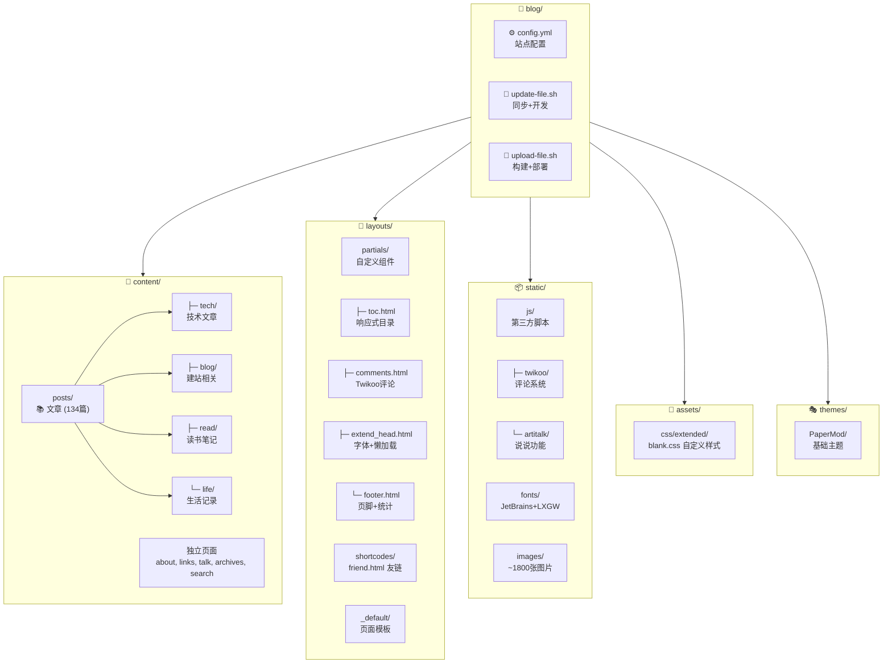

# CLAUDE.md

> 📅 最后更新: 2026-01-07 | 📊 项目文件数: ~2162 | 📝 文章数: 134

This file provides guidance to Claude Code (claude.ai/code) when working with code in this repository.

## Project Overview

Hugo 静态博客, 基于 PaperMod 主题 (源自 sulv 修改版). 内容使用中文, 通过 Obsidian 编写后同步至 Hugo.

- 站点地址: https://www.lvbibir.cn
- 主题仓库: https://github.com/adityatelange/hugo-PaperMod
- 模板仓库: https://github.com/xyming108/sulv-hugo-papermod

## Project Structure (Mermaid)



## Commands

### 开发

```bash
# 从 Obsidian 同步内容并启动开发服务器 (包含草稿)
./update-file.sh

# 仅启动开发服务器
hugo server -D
```

### 构建与部署

```bash
# 构建并部署到远程服务器
./upload-file.sh

# 仅构建静态文件
hugo -F --cleanDestinationDir
```

## Content Workflow

内容源自 Windows OneDrive 中的 Obsidian vault:
- 文章: `/mnt/c/Users/lvbibir/OneDrive/1-lvbibir/obsidian/lvbibir/blog/` -> `content/posts/`
- 图片: `/mnt/c/Users/lvbibir/OneDrive/1-lvbibir/obsidian/lvbibir/images/` -> `static/images/`

文章分类目录:
- `content/posts/tech/` - 技术文章
- `content/posts/blog/` - 建站相关
- `content/posts/read/` - 读书笔记
- `content/posts/life/` - 生活记录

## Architecture

### 自定义布局 (覆盖 PaperMod 主题)

| 文件 | 用途 | 关键特性 |
|------|------|----------|
| `layouts/partials/toc.html` | 自定义目录 | 宽屏侧边栏 + 移动端弹出 + 滚动高亮 |
| `layouts/partials/comments.html` | Twikoo 评论系统 | self-hosted, 版本可配置 |
| `layouts/partials/extend_head.html` | 自定义字体 + 图片懒加载 | IntersectionObserver API |
| `layouts/partials/footer.html` | 页脚 | 运行时间 + 不蒜子统计 + 阅读进度 |
| `layouts/shortcodes/friend.html` | 友链卡片 | 命名参数: name, url, logo, word |
| `layouts/_default/_markup/render-image.html` | 图片懒加载渲染 | data-src 延迟加载 |

### 第三方集成

| 功能 | 实现 | 位置 |
|------|------|------|
| 评论系统 | Twikoo (self-hosted) | `static/js/twikoo/` |
| 说说页面 | Artitalk (LeanCloud 后端) | `static/js/artitalk/` |
| 字体 | JetBrains Mono + LXGW 混合字体 | `static/fonts/JetBrainsLxgwNerdMono/` |
| 访问统计 | 不蒜子 | 外部脚本 |

### 自定义样式 (assets/css/extended/blank.css)

关键 CSS 变量:
```css
--article-width: 650px;    /* 文章宽度 */
--toc-width: 230px;        /* 目录宽度 */
--transition-duration: 0.4s; /* 动画时长 */
```

主要自定义:
- 标题样式 (h1-h6 带下划线)
- 暗色模式适配
- 图片圆角 + 点击放大
- 引言块绿色边框
- GitHub 风格表格
- 悬停动画类 (.hover-scale, .hover-shadow 等)

### 配置要点 (config.yml)

| 配置项 | 值 | 说明 |
|--------|-----|------|
| `hasCJKLanguage` | `true` | 中文字数统计 |
| `markup.goldmark.renderer.unsafe` | `true` | 允许 Markdown 中嵌入 HTML |
| `permalinks.post` | `"/:title/"` | 文章 URL 格式 |
| `params.ShowToc` | `true` | 显示目录 |
| `params.TocOpen` | `true` | 默认展开目录 |
| `params.twikoo.version` | `1.6.44` | Twikoo 版本 |

## Front Matter

文章常用 front matter:

```yaml
---
title: "文章标题"
date: 2024-01-01
lastmod: 2024-01-02  # 可选, 显示更新时间
tags: [tag1, tag2]
description: "文章摘要"
cover:
    image: "/images/xxx.png"  # 可选, 封面图
draft: false
---
```

## Shortcodes

友链使用:
```

```

## Module Index

| 模块 | 路径 | 文件数 | 说明 |
|------|------|--------|------|
| 布局 | `layouts/` | 17 | 自定义 HTML 模板 |
| 静态资源 | `static/` | ~1873 | JS/字体/图片 |
| 内容 | `content/` | 134+ | Markdown 文章 |
| 样式 | `assets/css/` | 1 | 自定义 CSS |
| 主题 | `themes/PaperMod/` | - | 基础主题 (git submodule) |

## Development Notes

### 图片懒加载实现

使用 IntersectionObserver API，在 `extend_head.html` 中实现:
- 图片初始使用 `data-src` 存储真实地址
- 进入视口 50px 范围时加载
- 兼容不支持 IO 的浏览器

### TOC 响应式设计

`toc.html` 实现了双模式目录:
- **宽屏模式**: 固定在文章左侧，可切换显示/隐藏
- **移动端模式**: 浮动按钮触发弹出层，支持 ESC 关闭

### 部署流程

```
Obsidian (Windows)
    ↓ rsync
content/posts/ + static/images/
    ↓ hugo build
public/
    ↓ rsync
远程服务器 (root@lvbibir.cn:/root/blog/data/hugo/)
```
