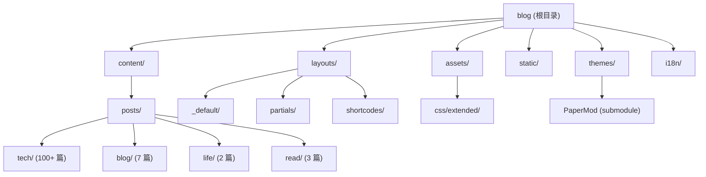

# CLAUDE.md - lvbibir's Blog

> Hugo 静态博客项目 AI 上下文指南

## 项目愿景

个人技术博客, 主要记录读书笔记, 技术积累, 生活感悟. 使用 Hugo 静态站点生成器, 基于 PaperMod 主题深度定制.

| 属性 | 值 |
|------|-----|
| 域名 | https://www.lvbibir.cn |
| 作者 | lvbibir |
| 框架 | Hugo (PaperMod 主题) |
| 语言 | 中文 (zh-cn) |
| 起始时间 | 2021-07-13 (WordPress), 2022-07-04 迁移至 Hugo |
| ICP 备案 | 京ICP备2021023168号-1 |

---

## 架构总览



### 目录结构说明

| 目录 | 职责 |
|------|------|
| `content/` | Markdown 内容文件, 按分类组织 |
| `layouts/` | Hugo 模板覆盖, 自定义布局和组件 |
| `assets/css/extended/` | 自定义 CSS 样式, PaperMod 扩展点 |
| `static/` | 静态资源 (图片, JS, 字体) |
| `themes/PaperMod/` | 主题子模块 (不直接修改) |
| `i18n/` | 国际化翻译文件 |

---

## 模块索引

| 模块 | 路径 | 职责 | 文档 |
|------|------|------|------|
| 内容 | `content/` | 博客文章和页面内容 | [content.md](./.claude/docs/content.md) |
| 布局 | `layouts/` | 模板覆盖和自定义组件 | [layouts.md](./.claude/docs/layouts.md) |
| 样式 | `assets/css/extended/` | CSS 自定义样式 | [css-extended.md](./.claude/docs/css-extended.md) |

---

## 运行与开发

### 本地开发

```bash
# 启动开发服务器
hugo server -D

# 构建生产版本
hugo --minify

# 创建新文章
hugo new posts/tech/article-name.md
```

### 依赖

- Hugo (静态站点生成器)
- PaperMod 主题 (Git 子模块)

```bash
# 初始化/更新主题子模块
git submodule update --init --recursive
```

---

## 编码规范

### Frontmatter 格式

```yaml
---
title: "文章标题"
date: 2024-01-01
lastmod: 2024-01-10
author: "lvbibir"
tags: ["tag1", "tag2"]
description: "文章描述"
weight: 1  # 排序权重, 数字越小越靠前
cover:
    image: ""  # 封面图片
hidemeta: false
---
```

### 命名约定

| 类型 | 规则 | 示例 |
|------|------|------|
| 文章文件 | 小写, 连字符分隔 | `docker-compose-usage.md` |
| 分类目录 | 小写单词 | `tech/`, `blog/`, `life/` |
| CSS 文件 | 功能描述, 小写 | `toc.css`, `code.css` |
| 图片资源 | `blog-` 前缀 | `blog-avatar.webp` |

### CSS 变量 (定义在 blank.css)

```css
:root {
    --footer-height: 160px;
    --hljs-bg: #1D1F21;
    --code-bg: rgba(0, 0, 0, 0.8);
    --article-width: 800px;
    --toc-width: 230px;
    --transition-duration: 0.2s;
    --box-shadow-default: 2px 2px 8px rgba(0, 0, 0, 0.2);
    --box-shadow-hover: 2px 2px 12px rgba(0, 0, 0, 0.3);
}
```

---

## 特性清单

| 特性 | 实现位置 | 说明 |
|------|----------|------|
| 目录 (TOC) | `layouts/partials/toc.html`, `toc.css` | 响应式目录, 支持桌面固定和移动端弹出 |
| 评论系统 | `layouts/partials/comments.html` | Twikoo 自托管评论 |
| 图片懒加载 | `layouts/partials/extend_head.html`, `render-image.html` | IntersectionObserver 实现 |
| 代码块 | `layouts/partials/footer.html`, `code.css` | Mac 风格代码块, 复制按钮 |
| 打赏按钮 | `layouts/partials/reward.html`, `reward.css` | 微信/支付宝二维码 |
| 友链卡片 | `layouts/shortcodes/friend.html`, `friend-link.css` | 自定义 shortcode |
| 访问统计 | `layouts/partials/footer.html` | 不蒜子统计 |
| 阅读进度 | `layouts/partials/footer.html` | 滚动百分比显示 |

---

## AI 使用指引

### 常见任务

1. **添加新文章**: 在 `content/posts/<category>/` 下创建 `.md` 文件, 使用标准 frontmatter
2. **修改样式**: 编辑 `assets/css/extended/` 下的 CSS 文件
3. **修改布局**: 编辑 `layouts/` 下的模板文件 (覆盖主题默认)
4. **添加翻译**: 编辑 `i18n/en.yaml`

### 注意事项

- 不要直接修改 `themes/PaperMod/` 目录, 使用 `layouts/` 覆盖
- CSS 变量定义在 `assets/css/extended/blank.css`
- 主题配置在 `config.yml`
- 图片资源放在 `static/images/`

---

## 变更记录 (Changelog)

| 日期 | 变更 |
|------|------|
| 2026-01-10 | 初始化 CLAUDE.md 项目文档 |

---

## 扫描覆盖率

| 指标 | 值 |
|------|-----|
| 估算总文件数 | ~200+ |
| 已扫描文件数 | ~50 |
| 覆盖百分比 | ~25% |
| 扫描时间 | 2026-01-10T23:06:46+0800 |

### 已扫描

- config.yml (完整)
- layouts/ 目录 (核心模板)
- assets/css/extended/ (全部 CSS)
- content/ 目录结构
- i18n/en.yaml

### 未完全扫描

- static/ 目录 (资源文件)
- themes/PaperMod/ (子模块, 按需参考)
- 具体文章内容 (134 篇 markdown)
